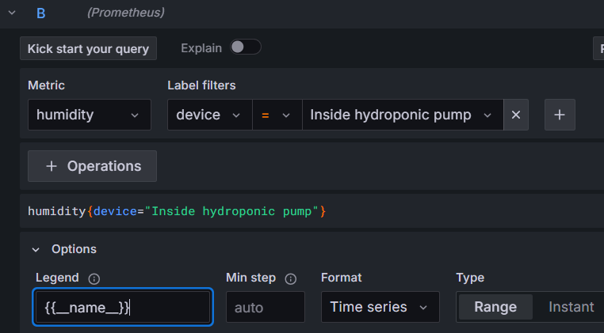
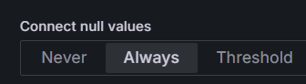

# Creating your own dashboard

Open grafana in your favorite browser

    http://localhost:3000

The default username/password is _admin/admin_

Navigate to _Dashboards_ and click _New_, then select _New dashboard_

Then click the _Add visualisation_

And select the default datasource

Then click in the _Select metric_ field and select your metric

This example will show the temperature and humidity metrics

You can add label filters to narrow the metric to your specific device

Here I added the temperature for my _Inside hydroponic pump_

And I set the _Legend_ to be the name of the metric

And I added a metric for humidity as well

Then, in the _Panel options_, rename the dashboard to _Living room_. If your hydroponics setup is in another room, then use that name. Because everybody has a hydroponics setup, right?

Then save the dashboard, and get back to it

And you should be able to see your beautiful dashboard

To connect the lines, under _Panel Options_ to the right, scroll down to _Connect null values_ and select _Always_

